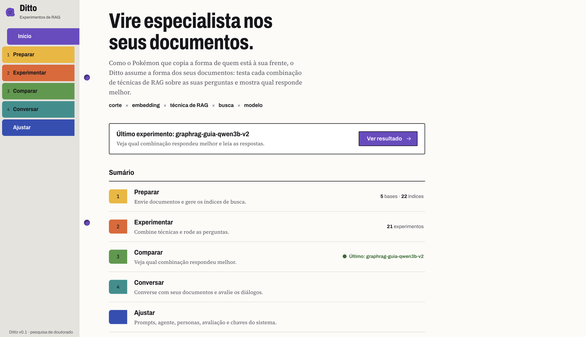

# Ditto

[](https://github.com/samuhs/ditto_system/actions/workflows/ci.yml)
[](LICENSE)


Ever tried to pick the "best" RAG setup and realized you're just guessing? Which chunker, which embedder, which retriever, which prompt trick, which model? Ditto runs the whole grid for you.

You feed it your documents and a list of questions. It tries every combination of **chunking × embedding × RAG technique × retriever × LLM**, scores each one on quality metrics, and shows you a ranked table. There's also a chat agent (built on LangGraph) with swappable personas that reuses the same pipelines, so you can actually talk to your data once you've found a setup you like.

I built it for my PhD, but it works fine as a general playground for comparing RAG strategies on your own stuff.



> The code is in English. The web UI is in Portuguese (PT-BR), so heads up if that's not your language.
>
> **Status:** active research software, used daily for a PhD. Expect the API and database schema to change between commits; there are no tagged releases yet.

**Contents:** [What you get](#what-you-get) · [How it fits together](#how-it-fits-together) · [Get it running](#get-it-running-docker) · [Configuring it](#configuring-it) · [Running from source](#running-from-source) · [Security](#one-security-note) · [Contributing](#contributing) · [Citing](#citing-ditto) · [License](#license)

---

## What you get

- **The big grid.** 5 chunkers, 5 embedders, 10 RAG techniques, 4 retrievers, and however many LLMs you want, run over a CSV of questions and ranked by 12 metrics.
- **Everything is a plugin.** Each technique sits behind an interface and a registry. Write a class, register it, and it shows up in the UI on its own. No wiring.
  - Chunking: `fixed`, `recursive`, `token`, `semantic`, `markdown`
  - Embeddings: `gemini`, plus local `e5`, `paraphrase`, `granite` and `embeddinggemma` (gated: needs `HF_TOKEN`)
  - RAG: `naive`, `agentic`, `hyde`, `rerank`, `crag`, `compression`, GraphRAG (`graph`, `graph_mix`), and two baselines: `closed_book` (no retrieval) and `oracle` (the annotated evidence as context, the LLM's best case)
  - Retrievers: `similarity`, `mmr`, `multi_query`, `parent_document`
  - LLMs: Gemini (`gemini-2.5-flash-lite`) and every model on your local server (MLX or Ollama), each listed by its real name and tagged `local` or `remoto`. Temperature and the answer's token cap are set per experiment.
  - Metrics with an embedder: `answer_relevancy`, `faithfulness`, `context_precision`, `context_recall`, `answer_correctness`
  - Metrics with no model at all: `rouge_l`, `token_f1`, `chrf`, and, against annotated evidence, `context_hit`, `context_mrr`, `context_recall_gold`, `context_all_hops`
- **A results table that doesn't fight you.** Sort by any metric, filter by any dimension, paginate, and chart the results per dimension.
- **Knowledge graphs.** Build a *Grafo de conhecimento* from any index with an LLM extractor, then query it with the `graph` and `graph_mix` techniques.
- **Question difficulty.** Each experiment scores every question on cheap signals (IDF, length, negation, multi-hop, retrieval score gaps and more) so you can tell hard questions from bad configurations.
- **A chat agent.** LangGraph flow (guardrail, triage, RAG, memory, persona) with prompts you can edit and personas you can swap. Save the conversations and rate them 0 to 10.
- **Prompt control.** See and edit the prompts each technique uses. Every experiment saves a snapshot of the prompts it ran with, so old results stay reproducible.
- **Run it fully offline.** Pair a local Ollama model with a local embedder and you never touch a paid API.

---

## How it fits together

```
┌───────────┐     ┌───────────────────────────┐     ┌──────────┐
│ Frontend  │ ──▶ │ API (FastAPI, modular)    │ ──▶ │ Qdrant   │  vectors
│ React+Vite│     │ ingestion / experiments   │     ├──────────┤
│  (nginx)  │     │ chat / prompts / settings │ ──▶ │ Postgres │  runs & results
└───────────┘     └───────────────────────────┘     └──────────┘
                          │
                          ▼  (optional, on your host)
                 MLX or Ollama  ·  local LLM generation
```

- `backend/` is a FastAPI modular monolith. The interesting parts live in `backend/app/core/` (`chunking/`, `embedding/`, `retrieval/`, `rag/`, `llm/`, `evaluation/`, `graph/`, `difficulty/`, `chat/`, `vectorstore/`), each one a registry of pluggable techniques. HTTP routes sit in `backend/app/api/`.
- `frontend/` is React + Vite + TypeScript + Mantine. nginx proxies `/api/` to the backend.
- `database/` has a sample document (a travel-guide FAQ) so you can kick the tires right away.
- `docs/` holds the design specs and plans (`superpowers/`), architecture decisions (`adr/`), research notes (`research/`) and the original project proposal (`proposta-original.md`), if you want to see how it grew.

---

## Get it running (Docker)

You'll need [Docker](https://docs.docker.com/get-docker/) with Compose, and either a [Gemini API key](https://aistudio.google.com/apikey) or a local [Ollama](https://ollama.com). Grabbing a Gemini key is the fastest way in, since it powers the default embeddings.

```bash
git clone https://github.com/samuhs/ditto_system.git
cd ditto_system

make setup       # checks Docker, creates .env, asks for your Gemini key (optional)
make up          # api:8000 · frontend:3000 · qdrant:6333 · postgres:5432
make llm-setup   # optional: serve a local LLM with Ollama on your GPU (see below)
```

Now open **http://localhost:3000** and walk through it:

1. **Inserir documentos**: upload your files, or use the sample in `database/`.
2. **Gerar teste**: pick the combinations you want and a questions CSV. Only `pergunta` is required. Add `resposta_referencia` (the reference answer) for the answer metrics and `evidencia_referencia` (the passage that holds it) for the gold retrieval metrics and the `oracle` baseline. Multi-hop sets can also carry `evidencia_salto` and `entidades_ponte`; see `database/perguntas_guia_santo_antonio_da_alegria.csv`.
3. **Resultados**: see which combinations won, ranked by metric.

A few more commands when you need them:

```bash
make logs        # tail the logs
make down        # stop everything
make test        # backend tests (pytest)
make front-test  # frontend tests (vitest)
```

---

## Configuring it

Most config comes from `.env` (there's a `.env.example` to copy):

| Variable | What it's for | Docker default |
|---|---|---|
| `POSTGRES_PASSWORD` | Postgres password; `make setup` generates a random one for a new `.env` | *(random)* |
| `GEMINI_API_KEY` | Optional Gemini key (embeddings + Gemini LLM); without it Gemini is not offered | *(empty)* |
| `HF_TOKEN` | Hugging Face token, only for the gated `embeddinggemma` embedder | *(empty)* |
| `WEB_PORT`, `API_PORT`, `POSTGRES_PORT`, `QDRANT_PORT` | Host ports, when another project already uses one | `3000`, `8000`, `5432`, `6333` |
| `BIND_ADDR` | Interface `make up` publishes Postgres, Qdrant and the API on | `127.0.0.1` |
| `MAX_UPLOAD_SIZE_MB` | Largest upload the API accepts | `50` |

`.env.example` documents the rest (memory profile overrides, perplexity signal).

You can also set the **Gemini key** straight from the **Configurações** screen in the app, no restart needed. It lands in `backend/config/app_settings.json`, git-ignored and stored in plaintext (mode `600`), so keep it on your own machine.

### Going local: MLX or Ollama

The LLM server runs on your host, not in Docker, so it can use your GPU. `make llm-setup` picks the fastest option for your machine and sets it up end to end (install, start, download a model, test prompt, check that the API container reaches it):

| Server | Where | GPU | Pick it with |
|---|---|---|---|
| **MLX** (`mlx_lm.server`) | Apple Silicon Macs (the default there) | Metal | `make llm-setup` or `LLM_SERVER=mlx` |
| **Ollama** (native) | Linux, Intel Macs (the default there) | CUDA / ROCm / Metal | `LLM_SERVER=host` |
| **Ollama in Docker** | anywhere, including behind VPNs that break `127.0.0.1` | none on macOS | `LLM_SERVER=docker` |

```bash
make llm-setup                                   # best server for this machine + its default model
make llm-setup MODEL=Qwen2.5-7B-Instruct-4bit    # MLX: another model (short name = mlx-community/<name>)
make llm-setup LLM_SERVER=host MODEL=llama3.1:8b # native Ollama instead
YES=1 make llm-setup                             # answer yes to every prompt
```

The choice is saved in `.env` (`LLM_SERVER`), so later runs, `make up` (which also starts the server) and the model commands all follow it. Switching servers cleans up after the previous one. `make llm-up`, `make llm-down` and `make llm-status` start, stop and check it by hand.

**MLX** is Apple's framework for Apple Silicon: one process with an OpenAI-compatible API and batched decoding. It lives in `~/.ditto/mlx` (outside the repo, so iCloud-synced folders can't evict it; `DITTO_HOME` moves it), listens on `localhost:11436` (`MLX_PORT`), and serves `PARALLEL` requests at once (default 4). Models come from Hugging Face, ready-made MLX conversions live at [huggingface.co/mlx-community](https://huggingface.co/mlx-community), and they're cached in `~/.cache/huggingface`.

**Native Ollama:** on Linux `llm-setup` makes it listen beyond `localhost` (`OLLAMA_HOST=0.0.0.0`) so the containers can reach it, which also exposes port 11434 on your network, so firewall it on shared machines. It sets `OLLAMA_NUM_PARALLEL` (default 4); on macOS that goes through `launchctl setenv`, which doesn't survive a reboot.

**Behind a corporate VPN (Ollama in Docker):** some VPN/security agents on macOS break outgoing connections to `127.0.0.1` ("can't assign requested address"). Native Ollama talks to its own runner over a fixed `127.0.0.1` port, and the API container reaches host servers through the host's loopback, so neither MLX nor native Ollama works there. `make llm-setup` detects this and offers Ollama in Docker: the container's loopback lives inside the Docker VM, out of the agent's reach. It's slower on a Mac because Docker has no Metal GPU, so prefer small models. If the container can't download models on your network, run `ollama pull <model>` on the host and repeat the command: it mounts `~/.ollama/models`. The container also answers on the host at `localhost:11435`.

**Without Docker for the app (`make up-local`):** runs the API (`backend/.venv`) and the frontend (Vite) on the host, and keeps only Postgres and Qdrant in Docker. Every local connection goes over IPv6 loopback (`[::1]`), including MLX. That's the way to get GPU speed on machines whose VPN breaks `127.0.0.1`: there the API container can't reach a server on the host, but a host-run API can. `make llm-setup` notices the broken loopback and sets MLX up for this mode.

```bash
make setup-dev          # once: backend venv + frontend packages (LOCAL=1 for the e5/paraphrase embedders)
make up-local           # Postgres + Qdrant in Docker, API + frontend + MLX on the host
make status-local       # what's running
make down-local         # stop it (the LLM server keeps running; make llm-down stops it)
make doctor             # tests every network hop and says which mode fits this machine
```

`make up` and `make up-local` share the same ports and data, and each one stops the other's API and frontend, so you can switch freely. Logs live in `.tools/local/`.

**Managing models** works the same on every server; the app lists them live, no restart needed:

```bash
make model-add Qwen2.5-7B-Instruct-4bit   # MLX (= mlx-community/Qwen2.5-7B-Instruct-4bit, or any org/repo)
make model-add qwen3:1.7b                 # Ollama
make model-rm <model>                     # delete it (it leaves the app)
make model-list                           # what the active server has
```

**Running experiments faster:** the **Gerar teste** screen has a **Perguntas em paralelo** field (1 to 32). Above 1, Ditto answers that many questions of each combination at the same time. That only speeds things up if the server can serve requests concurrently (`OLLAMA_NUM_PARALLEL`, `llama-server -np`, vLLM). Keep in mind that the per-question latency then also counts the time a request spent waiting in the server's queue.

**Measuring your machine:** `make bench-llm MODEL=<model>` sends RAG-shaped prompts at 1, 2, 4 and 8 concurrent requests and prints wall time, tokens/s and p50/p95 latency. It takes `LEVELS=1,2,4 N=16 BASE_URL=...` and works against any OpenAI-compatible server (the active one by default). Use it to pick a sensible parallelism. For a comparison of inference servers for small models, see [docs/research/2026-09-23-inferencia-small-llms.md](docs/research/2026-09-23-inferencia-small-llms.md).

Want to skip Google entirely? The Docker image already bundles the local embedders (`e5`, `paraphrase`). Pick one of those plus a local model (MLX or Ollama) and nothing leaves your machine. The embedder pulls its weights the first time you use it and caches them in the `hf_cache` volume, so it only happens once. That does make the image chunky (PyTorch comes along for the ride). If you only ever use Gemini embeddings, drop the `[local]` extra from `backend/Dockerfile` and the image slims right back down.

### Memory profiles (8 GB machines)

Running an LLM and embedders locally on an 8 GB Mac is tight. Ditto has two memory profiles, stored as `MEMORY_PROFILE` in `.env`. Machines with 8 GB or less start on `low`; everything else starts on `standard`.

| | `low` | `standard` |
|---|---|---|
| Local embedders kept in memory | 1 (switching unloads the previous one) | 3 |
| Where embedders run | CPU | GPU, only when no local LLM can be using it; CPU otherwise |
| MLX parallelism / prompt cache | 2 / 2 entries, 512 MB | 4 / 10 entries, no cap |
| Ollama | `NUM_PARALLEL=2`, `MAX_LOADED_MODELS=1`, q8_0 KV cache | `NUM_PARALLEL=4`, Ollama defaults |
| Questions in parallel per experiment | up to 2 | up to 32 |
| Docker container memory limits | yes | no |
| Trade-off | slower experiments | may swap if RAM runs out |

In both profiles an embedder never shares the GPU with a local LLM, experiments run one at a time (the rest wait as "Na fila"), and combinations run LLM by LLM so each model loads once.

Experiments run in three stages so that only one model sits in memory at a time. First every question is embedded once per embedding model, and the embedder is unloaded. Then the answers are generated LLM by LLM, with retrieval served from those precomputed vectors. Finally the local LLM is asked to unload (Ollama only; MLX keeps one model and swaps it) and the answers are scored with the evaluation embedder, which the page shows as "Avaliando as respostas". The embedder comes back during generation only for text the LLM writes itself (HyDE, multi-query, CRAG/agentic rewrites), and then on the CPU. `"staged": false` in an experiment's config runs the old single pass.

```bash
make memory-profile                    # active profile and what it changes
make memory-profile PROFILE=standard   # switch (restarts the LLM server); then make up or make up-local
make mem-watch                         # free memory, swap, API/MLX memory and loaded models every 2 s
```

On `low`, `make up` recommends `make up-local`: without the API in the Docker VM, more RAM is left for the LLM. Values set explicitly in `.env` (`MLX_PARALLEL`, `MAX_LOCAL_MODELS`, `MAX_EXPERIMENT_CONCURRENCY`, `EMBEDDING_DEVICE=cpu`) win over the profile. The **Configurações** screen shows the active profile, what is loaded, and the command to switch.

---

## Running from source

You'll want Python 3.11+ (the dev venv uses 3.13) and Node 22. You still need Qdrant and Postgres around, and the easy move is `make up` for just the datastores while you run the app locally.

The quick way is one command. It creates `backend/.venv`, installs the frontend packages, sets up graphify (the code knowledge graph and its git hooks) and fetches the impeccable design engine. It is safe to re-run and works behind corporate VPNs:

```bash
make setup-dev          # add LOCAL=1 for the local embedders (pulls torch)
```

Or by hand:

```bash
# backend
cd backend
python -m venv .venv && source .venv/bin/activate
pip install -e ".[dev]"          # use "[dev,local]" if you want local embedders
python -m pytest
uvicorn app.main:app --reload

# frontend
cd frontend
npm install
npm run dev
npm test                         # add -- --run for a single pass
```

Three things to know before you touch the code:

- Every technique is an interface plus a registry entry. To add one, you write a class and register it.
- Code stays in English (names, docstrings, errors). UI copy and prompts stay in PT-BR.
- Tests never hit the network or Postgres. They use Qdrant `:memory:`, SQLite, and injected fakes.

### Adding your own technique

Say you want a new RAG technique:

1. Drop `backend/app/core/rag/<name>.py` in place, implementing the `RAG` interface (`answer(query) -> RAGResult`).
2. Call `rag_registry.register("<name>", YourClass)` and import it in `backend/app/core/rag/__init__.py`.
3. If it uses prompts, add an entry to `PROMPT_SPECS`/`DEFAULT_PROMPTS` and drop the `.md` files under `backend/prompts/<name>/`.

That's it. It now shows up in `/options`, the experiment grid, the chat config, and the prompt editor. Same recipe for chunkers, embedders, retrievers, metrics, and LLM providers.

---

## One security note

Ditto has no login and assumes it's running somewhere you trust, for one person. Please don't put it on the open internet. Your secrets (the Gemini key) sit in `.env` and `backend/config/app_settings.json` as plaintext. Both are git-ignored, so keep them local. `make up` keeps Postgres, Qdrant and the API on `127.0.0.1`, but the frontend listens on every interface, and `make up-local` publishes Postgres and Qdrant on every interface. Firewall the machine if you're on a shared network.

Found a vulnerability? Please report it privately, as described in [SECURITY.md](SECURITY.md).

---

## Contributing

Pull requests are welcome. Keep the interface-plus-registry pattern for new techniques, add tests (pytest for backend, vitest for frontend), and keep both suites green with `make test` and `make front-test`. English in the code, PT-BR in the UI. For anything big, open an issue first so we can talk it through.

The details are in [CONTRIBUTING.md](CONTRIBUTING.md), and everyone taking part follows the [Code of Conduct](CODE_OF_CONDUCT.md). The domain vocabulary (*Base*, *Índice*, *Grafo de conhecimento*…) is defined in [CONTEXT.md](CONTEXT.md), and architecture decisions live in [docs/adr/](docs/adr/).

---

## Citing Ditto

If Ditto helps your research, please cite it. GitHub's **Cite this repository** button (from [CITATION.cff](CITATION.cff)) gives you APA and BibTeX.

---

## License

[MIT](LICENSE), © 2026 Samuel Henrique Silva.
